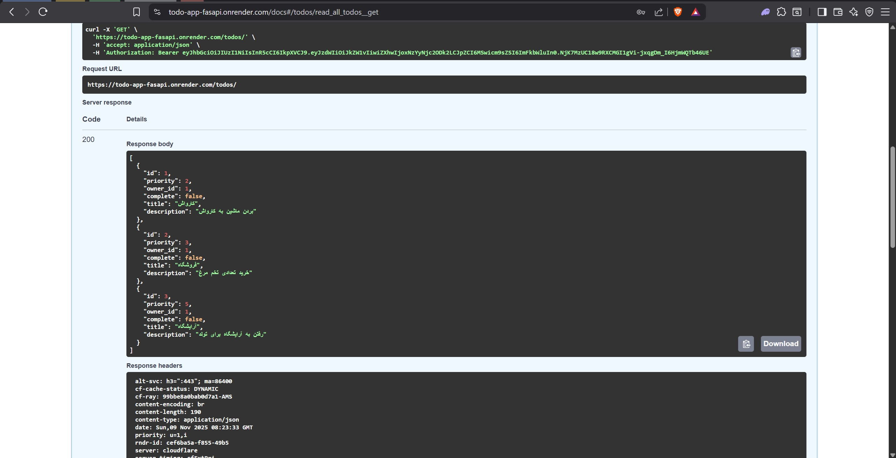

# Todo_App_FasAPI
Clean FastAPI Todo API with SQLite • JWT Auth

# TodoApp - FastAPI + SQLite Todo API




**A clean, production-ready Todo API with FastAPI + SQLite**  
Full CRUD, JWT auth, search/filter, priority

Live Demo: https://todo-app-fasapi.onrender.com/
API Docs: https://todo-app-fasapi.onrender.com/docs

{
username: demo
password: demo123
}

## Features

- Create, read, update, delete todos
- Priority (Low/Medium/High/Urgent)
- Tags & search/filter
- JWT authentication (register/login)
- Protected routes (only owner can edit)
- Automatic OpenAPI docs (Swagger + ReDoc)
- SQLite database (`todoapp.db`)
- No Docker, no complexity

## Quick Start

```bash
git clone https://github.com/Cod3Talk3r/Todo_App_FasAPI.git
cd Todo_App_FasAPI

python -m venv venv
venv\Scripts\activate  # Windows
# source venv/bin/activate  # Mac/Linux

pip install -r requirements.txt
python init_db.py
uvicorn app.main:app --reload
